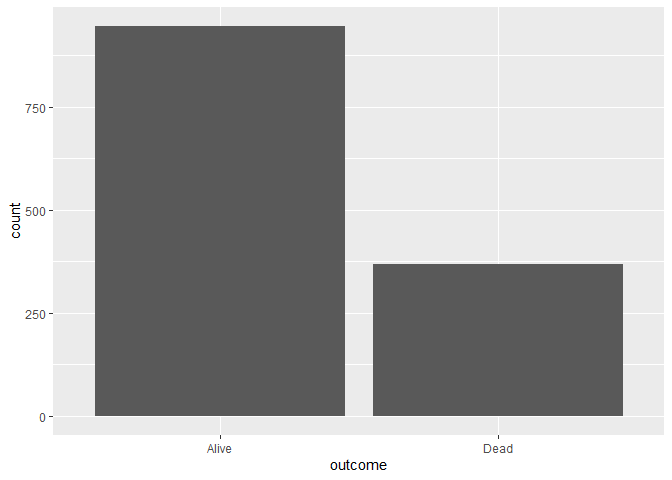
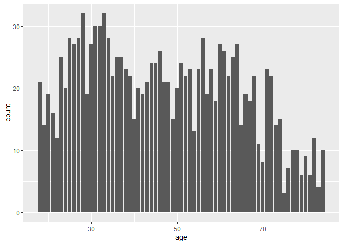
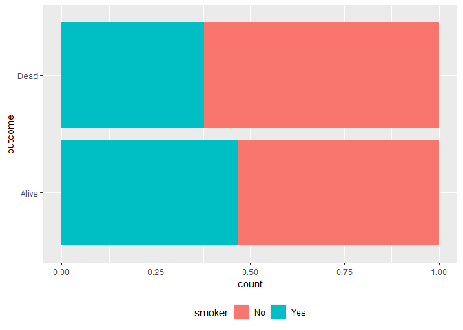
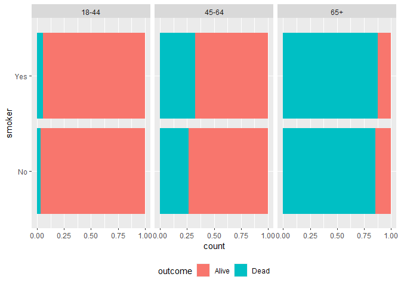

Lab 06 - Ugly charts and Simpson’s paradox
================
Zheqi Hu
2/13

### Load packages and data

``` r
library(tidyverse) 
library(dsbox)
library(mosaicData) 
library(usethis)
use_git_config(user.name = "jessieeeee77", 
               user.email = "huz220@wfu.edu")
```

### Exercise 1

``` r
staff <- read_csv("data/instructional-staff.csv",show_col_types = FALSE)
staff_long <- staff %>%
  pivot_longer(cols = -faculty_type, names_to = "year") %>%
  mutate(value = as.numeric(value))

staff_long %>%
  ggplot(aes(x = year, y = value)) +
  geom_point( aes(color = faculty_type))
```

<!-- -->

``` r
png(filename="faculty_type.png", width=600, height=400)
staff_long %>%
  ggplot(aes(x = year,
             y = value,
             group = faculty_type,
             color = faculty_type)) +
  labs (x = "year", y = "Amount", title = "hiring by faculty_type", fill = "faculty_type") + 
  geom_line()
```

\#Exercise 2

``` r
ggplot(staff_long, aes(y = faculty_type, fill = value)) +
  geom_bar(position = "fill") +
  facet_wrap(. ~ year) +
  scale_x_continuous() +
  labs(title = "hiring by faculty_type",
       x = NULL, y = NULL, fill = NULL) +
  theme(legend.position = "bottom")
```

<!-- -->

``` r
png(filename="faculty_type2.png", width=600, height=400)
staff_long %>%
  ggplot(aes(x = year,
             y = value,
             group = faculty_type,
             color = faculty_type)) +
  labs (x = "year", y = "Amount", title = "hiring by faculty_type", fill = "faculty_type") + 
  facet_wrap(. ~ faculty_type) +
  geom_line()
```

### Exercise 3

``` r
fisheries <- read_csv("data/fisheries.csv",show_col_types = FALSE)
#I think it might be better to show the proportion of the capture vs. aquaculture of fishes in each country, it might look better.


fish<- filter(fisheries, total > 1000000)
fish$PROP <- fish$capture/fish$total
png(filename="fish.png", width=900, height=400)
ggplot(fish,aes(x = country, y = PROP)) +  geom_line() +
  geom_point(position = "identity") 
```

    ## `geom_line()`: Each group consists of only one observation.
    ## ℹ Do you need to adjust the group aesthetic?

``` r
ggplot(fish,aes(x = country, y = aquaculture)) + 
  geom_point(position = "identity") 
```

<!-- -->

``` r
ggplot(fish, aes(x ="country", fill = aquaculture, color=country))+
    geom_bar(width = 1, position = "stack") +
  coord_polar(theta = "y")
```

<!-- -->

``` r
ggplot(fish, aes(x="", y=capture, fill=country)) + 
geom_bar(width = 1, stat = "identity") + coord_polar("y", start=0)
```

<!-- -->

``` r
ggplot(fish, aes(x="", y=aquaculture, fill=country)) + 
geom_bar(width = 1, stat = "identity") + coord_polar("y", start=0)
```

<!-- -->

``` r
ggplot(fish, aes(x="", y=total, fill=country)) + 
geom_bar(width = 1, stat = "identity") + coord_polar("y", start=0)
```

<!-- -->

``` r
#I think pie charts represent the country difference in capture and aquaculture significantly better.
```

\#Exercise 4

``` r
library(tidyverse) 
library(mosaicData) 
data(Whickham)
?Whickham
```

    ## starting httpd help server ... done

``` r
library(performance)

#Observation
#1314, each represents a smoker
#3, categorical, categorical, and numeric
```

``` r
Whickham %>%
ggplot(aes(x=outcome)) + geom_bar()
```

<!-- -->

``` r
Whickham %>%
  ggplot(aes(x=smoker)) + geom_bar()
```

<!-- -->

``` r
Whickham %>%
  ggplot(aes(x=age)) + geom_bar()
```

<!-- -->

``` r
#should be negatively associated.
```

``` r
Whickham %>%
  count(smoker, outcome) %>%
  group_by(smoker) %>%
  mutate(prop_outcome = n / sum(n)) %>%
  select(smoker, prop_outcome)
```

    ## # A tibble: 4 × 2
    ## # Groups:   smoker [2]
    ##   smoker prop_outcome
    ##   <fct>         <dbl>
    ## 1 No            0.686
    ## 2 No            0.314
    ## 3 Yes           0.761
    ## 4 Yes           0.239

``` r
Whickham %>% ggplot(aes(y = outcome, fill = smoker)) +
  geom_bar(position = "fill") +
  theme(legend.position = "bottom")
```

<!-- -->

``` r
#could not see the significant association between smoker and outcome. does not go as I expected. the non-smokers' (.68) death rate is higher than smokers'(.31). Apparently age should play a role in this association.
```

``` r
whick <- Whickham %>% 
  mutate(age_cat = dplyr::case_when(
      age <= 44 ~ "18-44",
      age > 44 & age <= 64 ~ "45-64",
      age > 64 ~ "65+"),
    age_cat = factor(age_cat,
      level = c("18-44", "45-64","65+")
    )
  )
```

``` r
whick %>%
  count(smoker, age_cat, outcome)
```

    ##    smoker age_cat outcome   n
    ## 1      No   18-44   Alive 327
    ## 2      No   18-44    Dead  12
    ## 3      No   45-64   Alive 147
    ## 4      No   45-64    Dead  53
    ## 5      No     65+   Alive  28
    ## 6      No     65+    Dead 165
    ## 7     Yes   18-44   Alive 270
    ## 8     Yes   18-44    Dead  15
    ## 9     Yes   45-64   Alive 167
    ## 10    Yes   45-64    Dead  80
    ## 11    Yes     65+   Alive   6
    ## 12    Yes     65+    Dead  44

``` r
whick %>%
  ggplot(aes(y = smoker, fill = outcome)) +
  geom_bar(position = "fill") +
  facet_wrap(. ~ age_cat) +
  theme(legend.position = "bottom")
```

<!-- -->

``` r
#from the graph, smoking might be associated with death between 45-64, and 65+. Can't tell if the associations between death and smoking were significant. The changes are due to the fact that people (at least in this sample) rarely die during age 18-44, and have higher death rate after age 65.
```

Add exercise headings as needed.
