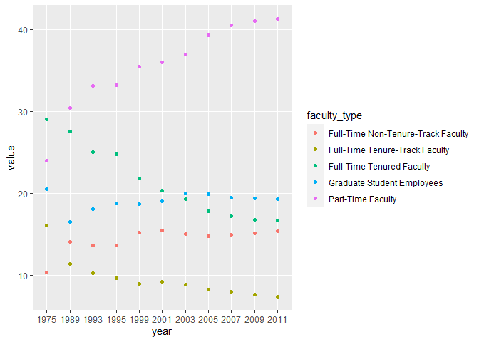
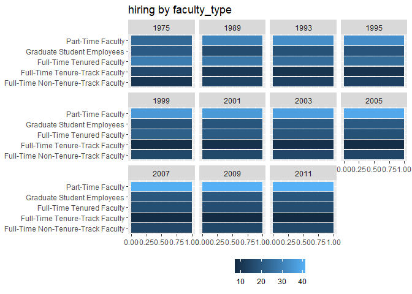

Lab 06 - Ugly charts and Simpson’s paradox
================
Zheqi Hu
2/13

### Load packages and data

``` r
library(tidyverse) 
library(dsbox)
library(mosaicData) 
library(usethis)
use_git_config(user.name = "jessieeeee77", 
               user.email = "huz220@wfu.edu")
```

### Exercise 1

``` r
staff <- read_csv("data/instructional-staff.csv")
```

    ## Rows: 5 Columns: 12
    ## ── Column specification ────────────────────────────────────────────────────────
    ## Delimiter: ","
    ## chr  (1): faculty_type
    ## dbl (11): 1975, 1989, 1993, 1995, 1999, 2001, 2003, 2005, 2007, 2009, 2011
    ## 
    ## ℹ Use `spec()` to retrieve the full column specification for this data.
    ## ℹ Specify the column types or set `show_col_types = FALSE` to quiet this message.

``` r
staff_long <- staff %>%
  pivot_longer(cols = -faculty_type, names_to = "year") %>%
  mutate(value = as.numeric(value))
staff_long %>%
  ggplot(aes(x = year, y = value, color = faculty_type)) +
  geom_line()
```

    ## `geom_line()`: Each group consists of only one observation.
    ## ℹ Do you need to adjust the group aesthetic?

<!-- -->

``` r
png(filename="faculty_type.png", width=600, height=400)
staff_long %>%
  ggplot(aes(x = year,
             y = value,
             group = faculty_type,
             color = faculty_type)) +
  labs (x = "year", y = "Amount", title = "hiring by faculty_type", fill = "faculty_type") + 
  geom_line()
```

``` r
ggplot(staff_long, aes(y = faculty_type, fill = value)) +
  geom_bar(position = "fill") +
  facet_wrap(. ~ year) +
  scale_x_continuous() +
  labs(title = "hiring by faculty_type",
       x = NULL, y = NULL, fill = NULL) +
  theme(legend.position = "bottom")
```

<!-- -->

``` r
png(filename="faculty_type2.png", width=600, height=400)
staff_long %>%
  ggplot(aes(x = year,
             y = value,
             group = faculty_type,
             color = faculty_type)) +
  labs (x = "year", y = "Amount", title = "hiring by faculty_type", fill = "faculty_type") + 
  facet_wrap(. ~ faculty_type) +
  geom_line()
```

Remove this text, and add your answer for Exercise 1 here. Add code
chunks as needed. Don’t forget to label your code chunk. Do not use
spaces in code chunk labels.

### Exercise 2

Remove this text, and add your answer for Exercise 1 here. Add code
chunks as needed. Don’t forget to label your code chunk. Do not use
spaces in code chunk labels.

### Exercise 3

…

Add exercise headings as needed.
